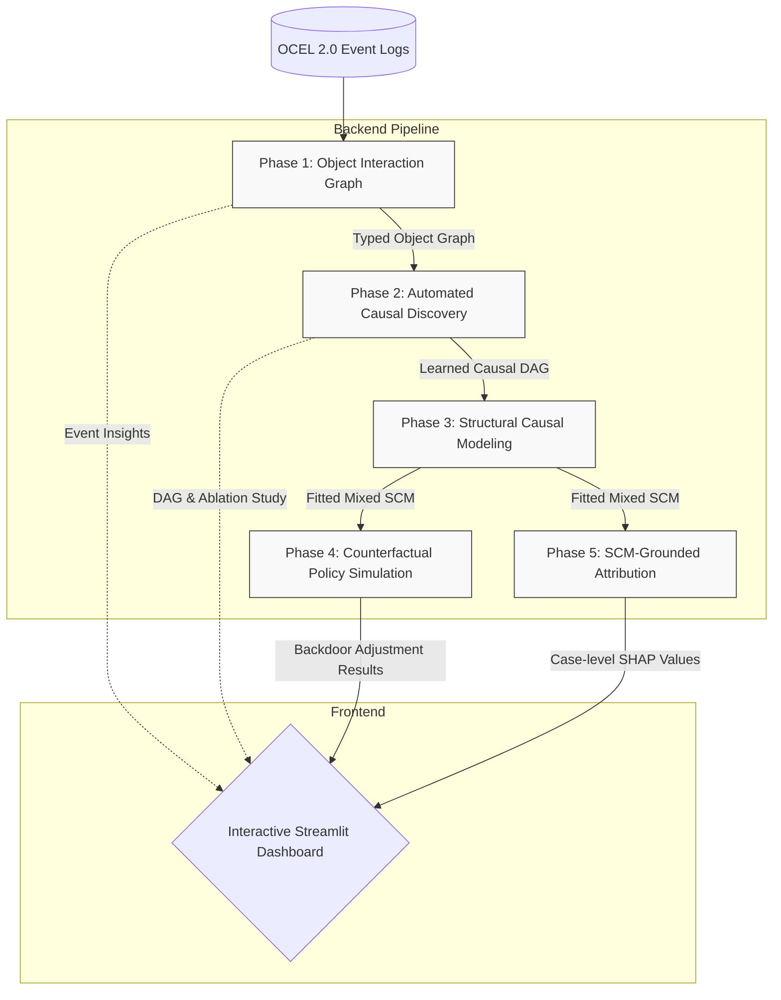

# CausalOCPM
**Causal-Explainable Object-Centric Process Mining**

  

CausalOCPM is an end-to-end analytical framework that bridges **Object-Centric Process Mining (OCPM)** and **Structural Causal Models (SCM)**. It enables rigorous, counterfactual policy evaluation in complex, multi-entity business processes.

---

## The Problem: The Confounding Trap

Traditional process mining relies on correlation. But in complex systems, correlations are often systematically inflated by unmeasured confounders.

Imagine a manufacturing scenario:
> *Complex orders preferentially use Supplier-A AND have inherently longer lead times.* 

Naive analysis overstates Supplier-A's causal contribution to delays by ~20%. **CausalOCPM** automatically identifies these confounders via causal discovery, removes their influence via backdoor adjustment, and recovers the *true* causal effect.

---

## Key Features

- **End-to-End Pipeline**: From OCEL 2.0 event logs to actionable causal insights.
- **Automated Causal Discovery**: Uses the PC Algorithm (Fisher's Z) with domain knowledge constraints to discover causal DAGs.
- **Structural Causal Modeling**: Fits mixed SCMs (Logistic, Linear, Gradient Boosting) without global linearity assumptions.
- **Counterfactual Policy Simulation**: DoWhy-powered backdoor adjustment and sensitivity analysis across random seeds.
- **SCM-Grounded Attribution**: Understand case-level root causes using advanced SHAP techniques applied directly to structural equations.
- **Interactive Streamlit Dashboard**: A comprehensive 7-tab UI to explore event logs, validate structural models, and simulate policies.

---

## Architecture Design

CausalOCPM is organized into a linear 5-phase backend pipeline that feeds directly into an interactive frontend dashboard. 



---

## Quick Start

### 1. Installation

Clone the repository and install the required dependencies:
```bash
git clone https://github.com/Aditya0105singh/CAUSALOCPM.git
cd CAUSALOCPM
pip install -r requirements.txt
```

*(Note: `causal-learn` is pip-installed as `causal-learn` but imported as `causallearn`.)*

### 2. Generate Data & Run Pipeline

You can generate synthetic data with planted ground truth for validation:
```bash
# Manufacturing domain
python data/generate_data.py

# Healthcare domain (Cross-domain validation)
python data/generate_healthcare.py
```

Process the data through the 5-phase pipeline:
```bash
python src/phase1_graph.py       # Object interaction graph
python src/phase2_discovery.py   # Causal DAG discovery
python src/phase3_scm.py         # Structural causal model
python src/phase4_dooperator.py  # Backdoor adjustment
python src/phase5_attribution.py # Case attribution
```

*(Optional) Run the full test suite to verify pipeline integrity:*
```bash
pytest -v tests/test_pipeline.py
```

### 3. Launch the Dashboard

```bash
streamlit run app/dashboard.py
```

---

## The Dashboard Experience

The interactive dashboard is divided into 7 specialized tabs:

1. **Event Log**: View event log summaries and sample OCEL object interaction graphs.
2. **Causal Discovery**: Inspect the learned DAG, highlighting confounding paths and ablation studies.
3. **Structural Model**: Validate the mixed model architecture, equation quality, and coefficient recovery.
4. **Policy Simulation**: Compare naive correlation vs. causal inference vs. planted ground truth. Includes deep sensitivity analysis.
5. **Case Attribution**: SCM-grounded SHAP waterfall charts for actionable, case-by-case insights.
6. **Real Data**: Validate against the BPI Challenge 2019 public benchmark.
7. **Domain Comparison**: Side-by-side generalisation analysis between Manufacturing and Healthcare domains.

---

## Validation Methodology

CausalOCPM rigorously validates its findings using **synthetic event logs with planted causal structures**. This allows for exact verification of recovered causal coefficients (must fall within ±0.5 of planted truth). The framework is robustly tested across 10 random seeds and 6 unmeasured confounder strengths.

| Phase | Component | Description |
|-------|-----------|-------------|
| **1** | `phase1_graph.py` | Extracts typed heterogeneous object interaction graphs from OCEL data. |
| **2** | `phase2_discovery.py`| Learns causal DAGs from data using the PC algorithm, refined by domain priors. |
| **3** | `phase3_scm.py` | Fits structural equations per node tailored to the data type. |
| **4** | `phase4_dooperator.py`| Estimates true causal effects via backdoor adjustment and validates robustness. |
| **5** | `phase5_attribution.py`| Calculates actionable SCM-grounded case attribution using SHAP. |

---

## Novelty & Impact

While tools like **PM4Py** excel at descriptive process analytics and **DoWhy/CausalNex** handle effect estimation, *no public tool integrates them.* 

**CausalOCPM is the first unified application to combine object-centric event logs, automated causal discovery, SCM fitting, and interactive counterfactual policy simulation** — all rigorously validated against planted ground truth across multiple domains.

---

## References

- Pearl, J. (2009). *Causality: Models, Reasoning and Inference*
- van der Aalst, W.M.P. et al. (2022). *Object-Centric Process Mining*
- Sharma, A., Kiciman, E. (2020). *DoWhy: An End-to-End Library for Causal Inference*
- Zheng, Y. et al. (2023). *causal-learn: Causal Discovery in Python*
- Heskes, T. et al. (2020). *Causal Shapley Values*
